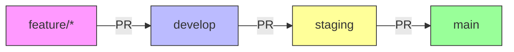

# 🚀 Cozy Cat Kitchen CI/CD Workflow

This document outlines the complete CI/CD pipeline for the Cozy Cat Kitchen eCommerce store, ensuring smooth deployments to production using Render's native GitHub integration.

## 🌟 Branch Strategy



## 🔄 Workflow Overview

### 1. Development Workflow (`.github/workflows/ci.yml`)
- **Triggers**:
  - Pushes to `feature/*`, `bugfix/*`, `release/*`
  - Pull requests to `develop`, `staging`, `main`
- **Actions**:
  - ✅ Node.js setup
  - 📦 `npm ci` (clean install)
  - 🧹 Linting (if configured)
  - 🏗️ Build process
  - 🧪 Tests (if configured)

### 2. Production Deployment (via Render)
- **Trigger**: Push to `main` branch
- **Configuration**: `render.yaml` at project root
- **Process**:
  1. Code is merged to `main`
  2. Render automatically detects changes
  3. Builds and deploys the application
  4. Runs health checks

### 3. Staging Environment (Optional)
For staging, you can either:
- Use a separate Render service with a different branch
- Or use feature branch previews in Render

## 🔧 Render Deployment Setup

### 1. Connect Your Repository to Render
1. Sign in to your [Render Dashboard](https://dashboard.render.com/)
2. Click "New" and select "Web Service"
3. Connect your GitHub repository
4. Select the repository: `aditya01889/cozystore`
5. Configure the service:
   - Name: `cozy-cat-kitchen`
   - Region: Choose the one closest to your users
   - Branch: `main`
   - Build Command: `npm install && npm run build`
   - Start Command: `npm start`
6. Click "Create Web Service"

### 2. Environment Variables
Add these in the Render dashboard under your service > Environment:
- `NODE_ENV=production`
- `NPM_CONFIG_PRODUCTION=false` (to install devDependencies)
- Any other environment variables your app needs

## 🛡️ Branch Protection Rules

### Main Branch (`main`)
- [ ] Require pull request reviews before merging
- [ ] Require status checks to pass before merging
- [ ] Require branches to be up to date before merging
- [ ] Do not allow bypassing the above settings
- [ ] Allow auto-merge
- [ ] Allow squash merging

### Staging Branch (`staging`)
- [ ] Require pull request reviews before merging
- [ ] Require status checks to pass before merging
- [ ] Do not allow bypassing the above settings
- [ ] Allow auto-merge
- [ ] Allow squash merging

## 🧪 Testing the Pipeline

### 1. Test Feature Branch
```bash
git checkout -b test/ci-cd
git add .
git commit -m "test: CI pipeline"
git push -u origin test/ci-cd
# Create PR to develop
```

### 2. Test Staging Deployment
1. Create PR from `develop` to `staging`
2. Wait for CI to pass
3. Merge PR
4. Verify deployment in Render dashboard

### 3. Test Production Deployment
1. Create PR from `staging` to `main`
2. Wait for CI to pass
3. Merge PR
4. Verify production deployment

## 🚨 Troubleshooting

### Deployment Not Triggering
- Verify webhook URL in GitHub secrets
- Check Render logs for webhook delivery
- Ensure branch protection rules allow deployments

### CI Failing
- Check GitHub Actions logs
- Run tests locally with `npm test`
- Verify all dependencies are in `package.json`

## 📝 Next Steps
- [ ] Set up environment variables in Render
- [ ] Configure custom domains
- [ ] Set up monitoring and alerts
- [ ] Implement database backups
