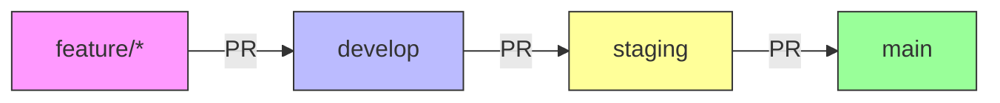

# 🚀 Cozy Cat Kitchen CI/CD Workflow

This document outlines the complete CI/CD pipeline for the Cozy Cat Kitchen eCommerce store, ensuring smooth deployments to both staging and production environments.

## 🌟 Branch Strategy



## 🔄 Workflow Overview

### 1. Development Workflow (`.github/workflows/ci.yml`)
- **Triggers**:
  - Pushes to `feature/*`, `bugfix/*`, `release/*`
  - Pull requests to `develop`, `staging`, `main`
- **Actions**:
  - ✅ Node.js setup
  - 📦 `npm ci` (clean install)
  - 🧹 Linting (if configured)
  - 🏗️ Build process
  - 🧪 Tests (if configured)

### 2. Staging Deployment (`.github/workflows/deploy-staging.yml`)
- **Trigger**: Push to `staging` branch
- **Environment**: Staging (preview)
- **Requires**: `RENDER_DEPLOY_HOOK_STAGING` secret
- **Process**:
  1. Code is merged to `staging`
  2. GitHub Actions triggers deployment
  3. Render receives webhook and deploys

### 3. Production Deployment (`.github/workflows/deploy-prod.yml`)
- **Trigger**: Push to `main` branch
- **Environment**: Production
- **Requires**: `RENDER_DEPLOY_HOOK_PROD` secret
- **Process**:
  1. Code is merged to `main`
  2. GitHub Actions triggers deployment
  3. Render receives webhook and deploys to production

## 🔑 Required GitHub Secrets

| Secret Name | Description | How to Get |
|-------------|-------------|------------|
| `RENDER_DEPLOY_HOOK_STAGING` | Webhook for staging deployments | Render Dashboard > Staging Service > Manual Deploy |
| `RENDER_DEPLOY_HOOK_PROD` | Webhook for production deployments | Render Dashboard > Production Service > Manual Deploy |

### Adding Secrets:
1. Go to GitHub Repository > Settings > Secrets and variables > Actions
2. Click "New repository secret"
3. Add each secret with its corresponding value

## 🛡️ Branch Protection Rules

### Main Branch (`main`)
- [ ] Require pull request reviews before merging
- [ ] Require status checks to pass before merging
- [ ] Require branches to be up to date before merging
- [ ] Do not allow bypassing the above settings
- [ ] Allow auto-merge
- [ ] Allow squash merging

### Staging Branch (`staging`)
- [ ] Require pull request reviews before merging
- [ ] Require status checks to pass before merging
- [ ] Do not allow bypassing the above settings
- [ ] Allow auto-merge
- [ ] Allow squash merging

## 🧪 Testing the Pipeline

### 1. Test Feature Branch
```bash
git checkout -b test/ci-cd
git add .
git commit -m "test: CI pipeline"
git push -u origin test/ci-cd
# Create PR to develop
```

### 2. Test Staging Deployment
1. Create PR from `develop` to `staging`
2. Wait for CI to pass
3. Merge PR
4. Verify deployment in Render dashboard

### 3. Test Production Deployment
1. Create PR from `staging` to `main`
2. Wait for CI to pass
3. Merge PR
4. Verify production deployment

## 🚨 Troubleshooting

### Deployment Not Triggering
- Verify webhook URL in GitHub secrets
- Check Render logs for webhook delivery
- Ensure branch protection rules allow deployments

### CI Failing
- Check GitHub Actions logs
- Run tests locally with `npm test`
- Verify all dependencies are in `package.json`

## 📝 Next Steps
- [ ] Set up environment variables in Render
- [ ] Configure custom domains
- [ ] Set up monitoring and alerts
- [ ] Implement database backups
